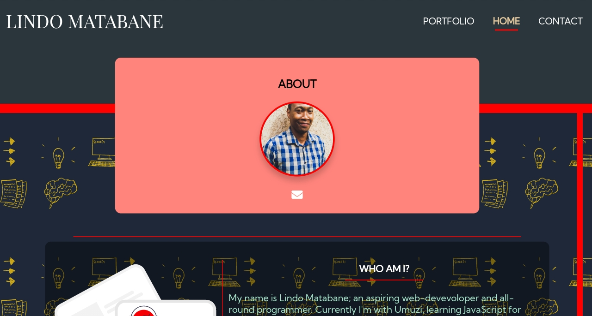

<h1 align="center">PERSONAL WEBSITE</h1>

  A responsive multiple page website to showcase my portfolio

## Screenshots

## Links

- [Repo](https://github.com/Rohit19060/personal_website/ "Personal Website Repo")

- [Website URL](https://lindo-code.github.io/personal_website/ "View Website")

## Built With

- JavaScript
- NPM
- HTML
- CSS

## Future Updates

- [ ] Responsive To Desktop

## Author

**Lindo Matabane**

- [Profile](https://github.com/Lindo-code "Rohit jain")
- [Email](mailto:sdrowvieli1@gmail.com?subject=Hi "Hi!")
- [Website](https://lindo-code.github.io/personal_website/ "Welcome")

## 🤝 Support

Contributions, issues, and feature requests are welcome!

Give a ⭐️ if you like this project!